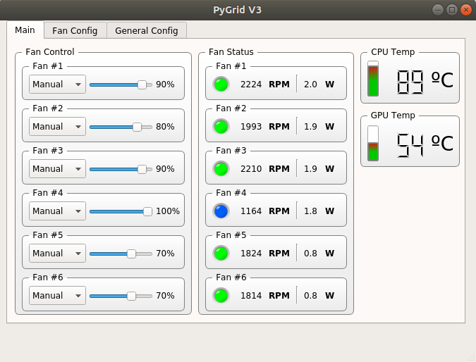

# pyGrid v3

## What is pygridv3 ?
pygridv3 is a GNU-Linux alternative to the proprietary NZXT CAM software. It's a simplistic qt5 graphical controller for NZXT Grid+ V3 written in Python 3.x.

## Working in progress
This project is in a very early stage of the development yet it resolve the main problem: control the fans speed (manualy) 😁  
### Features:
* **Fan state reading:** connection, speed and wattage
* **Fan control:** manual speed control

### Screenshot


## Dependencies

* Python 3.x
* pyqt5
* pyusb
* psutil
* nvidia-ml-py3

## Installation
Clone the repository

```
$ git clone https://github.com/vhessel/pygridv3
$ cd pygridv3
```
Install the Python dependencies  
(Obs. You might want to use a virtual environment)
```
$ pip install -r requirements.txt
```
Now, you can run the pygridv3 with sudo privileges:
```
$ sudo python3 pygridv3.py
```
### Optional
You can add a udev rule for the NZXT Grid+ V3 to allow your user access the hardware without sudo permissions.
Check the Vendor ID and Device ID with `lsusb`:
```
$ lsusb
>>> Bus 001 Device 005: ID 1e71:1711 NZXT
```
In the example above, `1e71` is the VendorID and `1711` is the ProductID (The hex numbers should be the same for your machine)  
Create a file `gridv3.rules` in the `/etc/udev/rules.d` directory with the following line:
```
SUBSYSTEM=="usb", ATTRS{idVendor}=="VendorID", ATTRS{idProduct}=="ProductID", MODE="0666"
```
Replace `VendorID` and `ProductID` with the values found in the last step.

After reboot, You should be able to run pygridv3 without sudo privileges.
